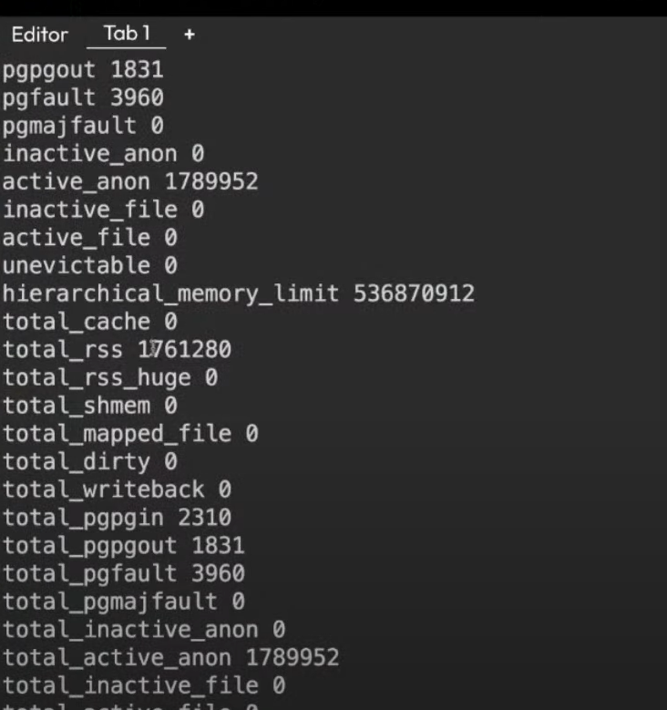
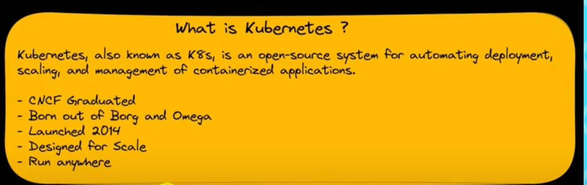

# Use the killer Coda PlayGround for HandsOn

  [KillerCoda](https://killercoda.com/playgrounds/scenario/kubernetes)

# Monolithic Application and Rise of microservices technology

A monolithic application refers to a software architecture in which all the components of an application are tightly coupled together into a single codebase and deployed as a single unit. let's say you have one nice website with consist frontend, backend, database, networking and messaging components and these components are bundled together and deployed as a single entity which is called `Monolithic`. So, there was a problem while handling the application. for example: if you wanna change in frontend then it might affect the other components  cause these all are part of one application and cannot run separately. If you would have to make the changes to a single entity then you would have to change the entire application. This was the main problem that all facing. Who solves this problem? Comes into the picture Microservices.

In microservices, Every single entity run as each application inside the container. Since we know that every single entity runs as a separate application but in actuality they are part of one application. So, there should be some sort of way that they have to communicate with each other. They communicate with each other via Service-mesh.

# Evolution of the Containers

At the beginning of the Internet thing, applications are run basically on the server. The problem was if the server load is increased we have to get new servers so this was not so cool. The idea is you can't run multiple applications on one server means One application = One server. It was time and cost-consuming.Who solves this problem? At that time there was a company named VM-WARE that comes into picture as Virtual machine.
But it was better than before but still didn't solve the problem that  it works on my machine and doesn't works on others machine. So, These all problems was solved by Docker Containers

# What is Docker ? 

Docker is an open-source platform that enables developers to automate the deployment, scaling, and management of applications using containerization. It provides a way to package applications and their dependencies into lightweight, isolated containers that can run consistently across different environments.

In simple terms, Docker is the container platform that helps to manage our containers.

# Archiecture of the Docker Engine 

# What are Containers?
Containers are Linux processes which run and isolate itself using Linux Namspaces.
These Namespaces will be different based on the OS.

# How does Linux Namspaces looks like and How to get these stuff pratically ? 

- `docker run -d --name my-nginx-container --memory 512m --cpus 1 nginx`
  
Starts a Docker container named "my-nginx-container" running Nginx, limiting its memory usage to 512 megabytes and restricting it to use only 1 CPU core.

  

- `ps aux | grep '[n]ginx' | sort -n -k 2 | head -n 1 | awk '{print $2}'`
  
Finds the process ID (PID) of the oldest Nginx process running on the host.

- `lsns -p <pid>`
  
Lists the namespaces associated with the process whose PID was obtained in the previous step.

# Check the memory used by the my-nginx-container

 `cat /sys/fs/cgroup/memory/system.slice/docker`

 You will get the output ending with `.scope`
 
 Example: `docker-5ba642ac2146b6d7f2c538d673a480f2ab6a4cec8142eae034286fdefcb5d024.scope` 

 `cat /sys/fs/cgroup/memory/system.slice/docker-5ba642ac2146b6d7f2c538d673a480f2ab6a4cec8142eae034286fdefcb5d024.scope/memory.stat`

 In output see the hierarchical Memory limit which is equal to the 512m
 
 
 
# Introduction to the Kubernetes 

# Why Kubernetes?

- Container Orchestration
-  Cluster Management
- Scaling
- Service Discovery and Load Balancing
- Self-healing
- Declarative Configuration
- Storage Orchestration
- Rolling Updates and Rollbacks
- Secrets and Configuration Management
- Multi-cloud and Hybrid Cloud

# Run the nginx container in kubernetes 
kubectl run nginx --image=nginx 

# How to interact with Container Runtime ? 
`crictl ps` 

Shows all the worloads running in the cluster
